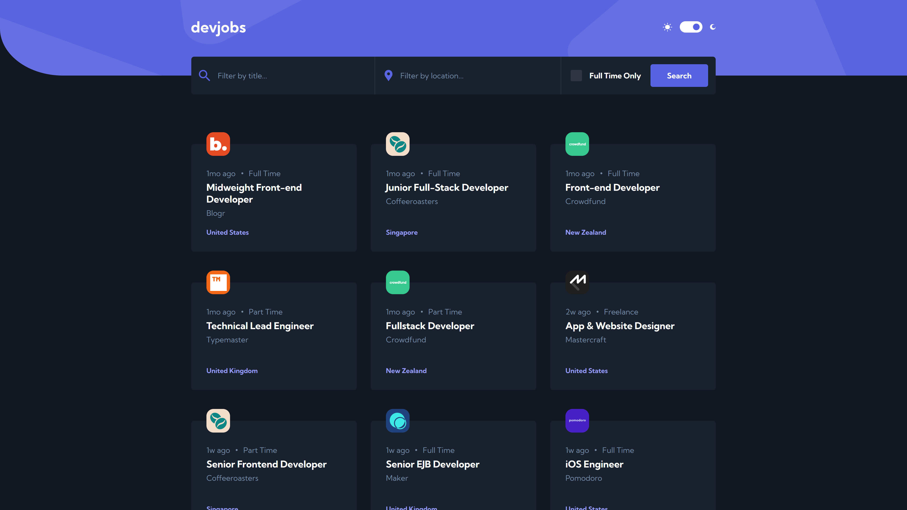

# Frontend Mentor - Devjobs web app solution

This is a solution to the [Devjobs web app challenge on Frontend Mentor](https://www.frontendmentor.io/challenges/devjobs-web-app-HuvC_LP4l). Frontend Mentor challenges help you improve your coding skills by building realistic projects.

## Table of contents

- [Overview](#overview)
  - [The challenge](#the-challenge)
  - [Screenshot](#screenshot)
  - [Links](#links)
- [My process](#my-process)
  - [Built with](#built-with)
  - [What I learned](#what-i-learned)
  - [Useful resources](#useful-resources)
- [Author](#author)

## Overview

### The challenge

Users should be able to:

- View the optimal layout for each page depending on their device's screen size
- See hover states for all interactive elements throughout the site
- Be able to filter jobs on the index page by title, location, and whether a job is for a full-time position
- Be able to click a job from the index page so that they can read more information and apply for the job
- **Bonus**: Have the correct color scheme chosen for them based on their computer preferences. _Hint_: Research `prefers-color-scheme` in CSS.

### Screenshot

### Links

- [Live Site Preview](https://mk-devjobs.netlify.app/)

## My process

### Built with

- [React](https://reactjs.org/)
- [TypeScript](https://www.typescriptlang.org/)
- [React Router](https://reactrouter.com/)
- [Create React App](https://create-react-app.dev/)
- [Styled Components](https://styled-components.com/)
- [GraphQL](https://graphql.org/)
- [Apollo Client](https://www.apollographql.com/docs/react/)
- [DatoCMS](https://www.datocms.com/)
- [Atomic Design](https://bradfrost.com/blog/post/atomic-web-design/)
- [Jest](https://jestjs.io/)
- [React Testing Library](https://testing-library.com/docs/react-testing-library/intro)
- [Mock Service Worker](https://mswjs.io/)
- [mswjs/data](https://github.com/mswjs/data)
- [Storybook](https://storybook.js.org/)
- [React-Modal](http://reactcommunity.org/react-modal/)
- Mobile-first workflow
- Flexbox
- CSS Grid

### Features

- Some of the contrast ratios didn't meet accessibility requirements so I tweaked them to meet at least AA **(Acceptable compliance)** level.
- Instead of `Load More` button, I have incorporated pagination.
- Main views in this app are lazy-loaded. This is a great way to minimize initial loading time for your app, in exchange for additional loading, when the user goes to a different view. In case of this project, it benefits in 0.2s shorter loading time in lighthouse mobile benchmark. The bigger the app, the bigger the impact.
- I have used a Headless CMS as a database for the job offers content. This allowed me to practice working with GraphQL API. Data is fetched using Apollo-client.
- During development I have used Mock Service Worker in combination with fakerjs library to create mock database and API. This way I avoided countless requests to my real API(which has limits). This is also a good technique if the API that you want to use is not yet ready.

### Useful resources

- [fakerjs](https://fakerjs.dev/api/address.html#city) - New documentation for faker package
- [React TypeScript Cheatsheet](https://github.com/typescript-cheatsheets/react)
- [Medium - How to Reduce React App Loading Time By 70%](https://javascript.plainenglish.io/speed-up-your-react-app-initial-load-using-code-splitting-f2de58c01ed2) - A Medium article on Lazy Loading in React
- [CSS Tricks - Complete Guide to Dark Mode](https://css-tricks.com/a-complete-guide-to-dark-mode-on-the-web/)

## Author

- Frontend Mentor - [@MieszkoKowalik](https://www.frontendmentor.io/profile/MieszkoKowalik)
